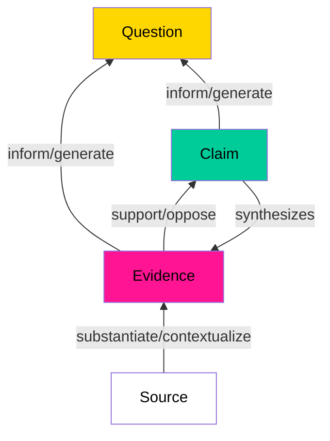
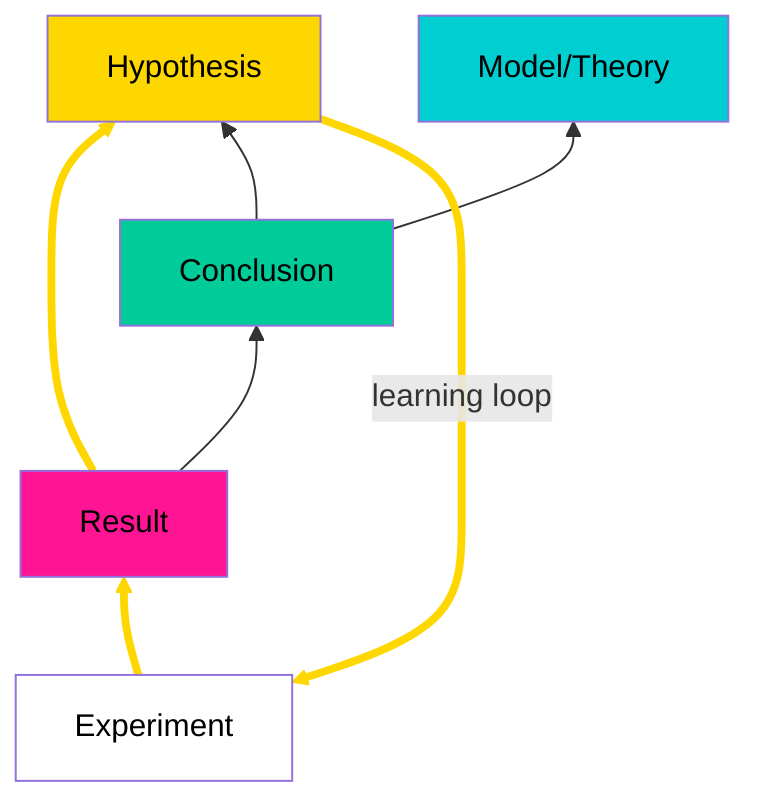
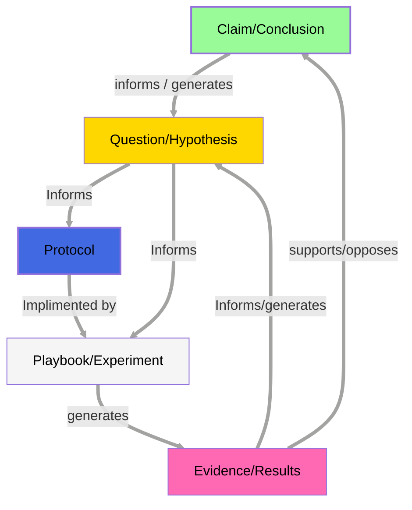

## Executive Summary

As we face increasingly complex global challenges, there's a growing need to transform our relationship with knowledge from passive consumption to active stewardship. Central to this transformation is the development of open protocols that can serve as composable building blocks for societal systems. Collective sensemaking emerges as a crucial capability, enabling communities to cultivate and propagate knowledge and wisdom effectively.

This proposal explores how <a href="https://scalingsynthesis.com/q-what-is-a-decentralized-discourse-graph/" target="_blank">**decentralized discourse graphs**</a> can be integrated into collective sensemaking protocols to enhance knowledge building, support the implementation of open protocols, and facilitate the evolutionary adaptation of our social systems. By emphasizing decentralization and democratization, we can ensure that knowledge networks become true commons—accessible to all and enriched by many.

## Introduction

In the face of an existential <a href="https://www.sloww.co/meta-crisis-101/" target="_blank">**metacrisis**</a>, humanity must reimagine itself as an intrinsic part of the living world, responsible for the vitality of our planet and communities. <a href="https://opencivics.co/" target="_blank">**OpenCivics**</a> proposes an approach where civic infrastructures localize and distribute resources and decision-making via open, participatory mechanisms. This necessitates the development of [open protocols](/OpenProtocols)—patterns of human coordination that function as civilizational services using a networked approach.

### The Value of Decentralized Discourse

To effectively develop and propagate open protocols, we require a decentralized, democratized method for mapping and [synthesizing](https://scalingsynthesis.com/q-what-is-synthesis/)  collective knowledge. <a href="https://scalingsynthesis.com/q-what-is-a-decentralized-discourse-graph/" target="_blank">**Decentralized discourse graphs**</a>
 offer a solution by enabling bottom-up knowledge creation across multiple domains.

## What Are Discourse Graphs?


<!-- <figure>
  </img>
  <figcaption>
    <small>
      <a href="https://ask.pubpub.org/about" target="_blank">Source: A Discourse Graph primer</a>
    </small>
  </figcaption>
</figure> -->

[Discourse graphs](https://ask.pubpub.org/about) are data structures that represent knowledge as a network of interconnected nodes—such as questions, claims, evidence—and relationships like supports or opposes.

The concept of discourse graphs as a structured approach to organizing knowledge has evolved over time, with different variants emerging to suit various needs and contexts. The discourse graph model described above is based on conventions proposed by <a href="https://joelchan.me/" target="_blank">**Joel Chan**</a>. However, adaptations have developed in other academic fields, reflecting unique terminologies and practices.

For instance, biologist <a href="https://matsulab.com/" target="_blank">**Matt Akamatsu**</a>'s *Results Graph* modifies the discourse graph model to align with experimental science. In this model, experiments yield data that either supports or opposes specific conclusions and generates new hypotheses. This structure reflects the iterative nature of scientific inquiry, where hypotheses motivate further experimentation, and experimental conclusions contribute to our evolving scientific theories and models of the world.



<!-- <figure>
  </img>
  <figcaption>
    <small>
      <a href="https://ask.pubpub.org/about" target="_blank">Source: A Discourse Graph primer</a>
    </small>
  </figcaption>
</figure> -->

In the Open Civics community, there is a unique opportunity to explore learning loops: how iterative experimentation, civic theory-building, and collaborative frameworks can be visually and structurally represented within discourse graphs to deepen our understanding of decentralized civilizational systems. Beyond conventional discourse and results graph ontologies, we might consider how implementations of protocols—each as an experiment in civic design—could generate evidence to support or refine civic hypotheses, thereby motivating further experimentation and adaptations across regions or contexts.

### Modified Graph with Protocols & Playbooks


### Decentralizing the Discourse Graph

Decentralization of discourse graphs means:

- **Distributed Contribution:** Allowing anyone to add to the knowledge base.
- **Role Diversification:** Supporting diverse roles in the knowledge commons:
  - **Primary Researchers:** Contribute original research and data
  - **Synthesizers:** Formalize and connect research into coherent frameworks
  - **Annotators:** Read and annotate content, making meaningful connections
  - **Validators:** Evaluate contributions to improve signal-to-noise ratio
  - **Facilitators:** Help determine directions for exploration
  - **Stewards:** Manage specific knowledge domains or bioregional commons
- **No Central Authority:** Eliminating centralized control over knowledge synthesis and validation.
- **Local Autonomy:** Supporting bioregional and domain-specific knowledge commons managed by local experts or communities.

## Alignment with OpenCivics' Objectives

<details>
<summary> Decentralized Collaboration and Democratization</summary>

- **Inclusivity:** By decentralizing the discourse graph, we empower a diverse range of participants to contribute, reflecting the democratized ethos of OpenCivics.
- **Commons-Based Approach:** Knowledge networks become a shared resource, accessible and contributable by all, embodying the principles of a knowledge commons.
- **Stigmergic Coordination:** Decentralized contributions lead to emergent patterns of organization without centralized control.
</details>

<details>
<summary> Addressing Human Behavior Challenges</summary>

- **Lowering Barriers to Entry:** By allowing participants to contribute in various capacities based on their interests and strengths, we accommodate varying levels of engagement.
- **Encouraging Participation:** Implementing mechanisms such as reputation systems, rewards, or acknowledgment can motivate contributions.
- **Reducing Complexity:** Providing user-friendly tools and interfaces makes it easier for participants to engage without becoming overwhelmed.
</details>

<details>
<summary> Supporting Localized Knowledge Commons</summary>

- **Bioregional Knowledge Commons:** Allow communities to manage knowledge relevant to specific regions, fostering local autonomy and relevance.
- **Domain-Specific Graphs:** Experts can oversee knowledge graphs in specialized domains, ensuring accuracy and depth.
</details>

## Supporting Progressive Formalization

The process of <a href="https://scalingsynthesis.com/c-synthesis-tools-need-to-support-incremental-formalization/" target="_blank">**incremental formalization**</a> is crucial for protocol development, allowing communities to start with informal documentation and gradually add structure as patterns and needs emerge. This approach addresses the cognitive overhead and premature structuring challenges identified in knowledge management systems.


### Stage 1: Informal Exploration and Discovery
<details>
<summary>Lightweight Entry</summary><br/>
Begin with minimal structure to maximize exploration and reduce cognitive overhead.

- Allow free-form documentation of community practices
- Support varied media types and formats 
- Defer formal categorization until patterns emerge
</details>

<details>
<summary>Emergent Question Formation</summary><br/>
Building on The Society Library's methodology, discourse graphs can implement a "descriptive emergent structuring" approach where:

- Questions emerge organically from collected evidence and claims
- Multiple perspectives and approaches are documented informally
- Initial relationships form naturally through basic linking and tagging
- Pattern recognition algorithms suggest potential structural relationships
</details>

<details>
<summary>Community Documentation</summary><br/>
Enable natural documentation flows with minimal barriers to entry.

- Capture approaches and evidence in their natural form
- Use simple markup or tags for basic organization
- Allow multiple entry points based on user preference and context
</details>

### Stage 2: Incremental Formalization

<details>
<summary>Pattern Recognition</summary><br/><br/>
Identify and surface emerging patterns in community knowledge.

- Automated systems identify recurring patterns in informal documentation
- Community stewards suggest potential formal structures
- Users can accept, modify, or reject suggested formalizations
</details>

<details>
<summary>Collaborative Specification</summary><br/>
Convert emerging patterns into more formal protocol specifications.

- Convert successful patterns into protocol specifications
- Maintain flexibility to adapt specifications as needs evolve
- Support multiple levels of formality simultaneously
</details>

<details>
<summary>Relationship Development</summary><br/>
Allow relationships to formalize naturally as their value becomes apparent.

- Formalize relationships between nodes as their utility becomes clear
- Support both structured and unstructured connections
- Enable search-based relationship discovery
</details>

### Stage 3: Adaptation and Evolution

<details>
<summary>Local Customization</summary><br/>
Support contextual adaptation of formalized protocols.

- Communities adapt formal protocols to local contexts
- Document variations through playbooks
- Maintain links between formal and informal elements
</details>

<details>
<summary>Organic Growth</summary><br/>
Enable natural evolution of protocols through community practice.

- Protocols evolve through community usage patterns
- Support both structured evolution (forking/merging) and informal adaptation
- Enable cross-pollination of ideas across communities
</details>

### Implementation Support

<details>
<summary>Role Flexibility</summary><br/>
Support diverse community roles in the formalization process.

- Curators: Help identify emerging patterns
- Connectors: Surface potential relationships
- Formalizers: Assist in structuring mature content
- Mediators: Bridge between formal and informal approaches
</details>

<details>
<summary>Technical Features</summary><br/>
Provide tools that support incremental formalization.

- Pattern recognition algorithms to suggest structure
- Rich search capabilities to surface related content
- Flexible metadata systems that grow with usage
- Tools for incremental addition of formal attributes
</details>

This approach balances the need for structure with the reality of how knowledge and practices evolve, allowing communities to formalize their understanding progressively while maintaining the benefits of emergent organization.

## Technical Overview

The implementation leverages existing decentralized tools and semantic web standards while introducing new structures for protocols and playbooks. Key features include:
- Document-based nodes with frontmatter metadata
- Support for protocols and playbooks as first-class citizens
- Integration with decentralized tools and semantic web standards
- Flexible query capabilities across federated instances

For complete technical specifications and implementation details, see [[#Appendix A: Technical Specification]].


## Practical Applications

<a href="https://www.societylibrary.org/" target="_blank">**The Society Library**</a>'s success in mapping complex societal debates demonstrates the practical viability of structured knowledge representation for collective sensemaking. Their experience shows that careful attention to bias reduction, comprehensive media coverage, and emergent structure can help create truly representative knowledge commons. By incorporating these lessons into our discourse graphs approach, we can better ensure our knowledge networks serve as genuine tools for democratic deliberation and collective wisdom building.

### The Open Protocol Library as a Knowledge Commons

The concept of an open protocol library exemplifies how knowledge commons can be structured to support collaborative research and development. As illustrated in our flowcharts, scientific inquiry involves iterative cycles of synthesis and validation, where evidence informs claims and generates new questions. A protocol library serves as a vital infrastructure for this process.

Consider the case of quadratic funding in the Cascadia Bioregion (see [[#Appendix B: Case Studies]]). This example demonstrates how:
- Communities can adapt formal protocols to local contexts
- Evidence from implementations feeds back into protocol development
- Local variations contribute to the broader knowledge commons
- Query capabilities enable learning across implementations

## Implementation Plan

### Steps Forward

<details>
<summary> 1. Establish Decentralized Infrastructure</summary>

   - Set up peer-to-peer networks and decentralized storage solutions.
   - Develop protocols for data synchronization and conflict resolution.
</details>
<details>
<summary> 2.  Define Community Roles</summary>

   - Clearly outline roles and responsibilities to encourage participation.
   - Provide guidelines and tools tailored to each role.
</details>
<details>
<summary> 3.  Develop User-Friendly Tools</summary>

   - Create interfaces that simplify interaction with the discourse graph.
   - Ensure accessibility across different devices and platforms.
</details>
<details>
<summary> 4.  Pilot Projects</summary>

   - Initiate pilot programs in selected bioregions or domains.
   - Gather feedback to refine processes and tools.
</details>
<details>
<summary> 5.  Community Engagement</summary>

   - Conduct outreach to educate potential participants.
   - Facilitate workshops and training sessions.
</details>
<details>
<summary> 6.  Iterative Development</summary>

   - Continuously improve based on user feedback and technological advancements.
   - Encourage open-source contributions to tool development.
</details>

### Success Metrics

1. **Participation Rates:** Measure the diversity and number of contributors.
2. **Decentralization Level:** Assess the distribution of data and control.
3. **Cross-Format Coherence:** Assess how well arguments and claims maintain consistency across different media formats
4. **Community Satisfaction:** Gather feedback on usability and impact.
5. **Protocol Evolution:** Track how protocols adapt and improve over time.
6. **Knowledge Diversity:** Evaluate the range of knowledge domains and regions represented.

## Conclusion

Integrating decentralized discourse graphs into Knowledge Commons aligns with the principles of decentralization, democratization, and collective stewardship. By distributing responsibilities and empowering diverse participation, we create a resilient and inclusive knowledge network that serves as a true commons. This approach not only enhances the development and propagation of open protocols but also embodies the transformative vision of reimagining ourselves as active stewards of our planet and communities. Together, we can harness the collective intelligence needed to address the existential challenges of our time. 

## Further Reading

[Discourse Graphs and the Future of Science](https://research.protocol.ai/blog/2023/discourse-graphs-and-the-future-of-science/)<br/>
[Mapping Investments in Scientific Public Goods](https://youtu.be/P0KUt2yrUkw)

---

# Appendix A: Technical Specification

### Document Structure with Decentralization in Mind

Each markdown file represents a node in the discourse graph, defined by frontmatter metadata.

#### Protocol Nodes
Protocols are general guidelines not tied to a specific locality. They are openly documented and freely available for anyone to use, implement, and modify.


```yaml
---
type: protocol
id: [protocol-id]
author: [author-id]
contributors:
  - [contributor-id]
relationships:
  - related_to: [node-id]
---
**Objective:** [Describe the purpose and goal of the protocol.]

**Scope:** [What's included and excluded in the protocol.]

**Procedures:** [Step-by-step instructions to achieve the objective.]

**Roles and Responsibilities:** [Who is responsible for each action within the procedures.]

**Materials and Equipment:** [What’s required to carry out the procedures.]

**Guidelines:** [Suggested considerations while conducting procedures.]

**Documentation:** [Suggestions on how to document the outcomes of the procedures.]
```

#### Playbook Nodes
Playbooks document the use or implementation of a protocol in a specific context or locality. They capture adaptations and practical applications.

```yaml
---
type: playbook
id: [playbook-id]
author: [author-id]
contributors:
  - [contributor-id]
protocol: [protocol-id]
locality: [bioregion or domain]
relationships:
  - implements: [protocol-id]
  - supports: [node-id]
  - opposes: [node-id]
permissions:
  read: public | group
  write: public | group
---
[Detailed documentation of how the protocol was implemented, including any adaptations or outcomes.]
```

#### Other Nodes

<details>
<summary>Question Nodes</summary>

  ```yaml
  ---
  type: question
  id: [question-id]
  author: [author-id]
  contributors:
    - [contributor-id]
  relationships:
    - related_to: [node-id]
  ---
  [Question text.]
  ```
</details>
<details>
<summary>Claim Nodes</summary>

  ```yaml
  ---
  type: claim
  id: [claim-id]
  author: [author-id]
  contributors:
    - [contributor-id]
  relationships:
    - supports: [node-id]
    - opposes: [node-id]
  ---
  [Claim text.]
  ```
</details>
<details>
<summary>Evidence Nodes</summary>

  ```yaml
  ---
  type: evidence
  id: [evidence-id]
  author: [author-id]
  contributors:
    - [contributor-id]
  relationships:
    - supports: [node-id]
    - opposes: [node-id]
  ---
  [Evidence content.]
  ```
</details>

### Integration with Decentralized Tools

- **Version Control:** Use decentralized version control systems like git and TerminusDB.
- **Publishing Platforms:** Leverage decentralized web technologies for hosting content: Arweave, IPFS, OriginTrail for example.
- **Local-first Editing Tools:** Promote the use of open-source, local-first, decentralized editors.
- **Contribution Mechanisms:** Implement systems that allow for merging contributions without central gatekeepers.
- **Federated Queries:** Allow queries to span across multiple nodes or instances, supporting a federated approach.

### Integration with Semantic Web Standards

The discourse graph structure naturally aligns with semantic web standards, enabling interoperability across different knowledge representation formats:

<details>
<summary>RDF Compatibility</summary>

- **Natural Mapping:** Discourse graph nodes and relationships map directly to RDF subject-predicate-object triples
- **Flexible Serialization:** Content can be represented in various formats (Markdown+frontmatter, JSON-LD, RDF/XML) while maintaining semantic meaning
- **Vocabulary Alignment:** Node types and relationships can be defined using standard RDF vocabularies or custom ontologies

Example of a Protocol node in JSON-LD:
```json
{
  "@context": {
    "@vocab": "http://opencivics.org/ns/",
    "dc": "http://purl.org/dc/terms/"
  },
  "@type": "Protocol",
  "@id": "protocol-qf",
  "dc:creator": "user111",
  "dc:contributor": ["user222"],
  "relationship": {
    "@type": "RelatedTo",
    "@id": "node-123"
  }
}
```
</details>


# Appendix B: Case Studies

## Quadratic Funding in the Cascadia Bioregion
**Question Node:**

```yaml
---
type: question
id: qf-001
author: "user789"
contributors:
  - "user101"
relationships:
  - related_to: [protocol-id for quadratic funding]
---
How can quadratic funding be effective for funding a synergistic set of projects in the Cascadia Bioregion?
```

**Protocol Node (Quadratic Funding):**

```yaml
---
type: protocol
id: protocol-qf
author: "user111"
contributors:
  - "user222"
relationships:
  - related_to: [node-id]
---
**Objective:** To democratize funding allocation by matching community contributions with a funding pool based on the quadratic funding mechanism.

**Scope:** Applicable to public goods projects seeking community support. Excludes projects that do not meet public goods criteria.

**Procedures:**
1. Projects submit proposals for funding.
2. Community members contribute funds to preferred projects.
3. Total contributions are matched from a funding pool using the quadratic funding formula.

**Roles and Responsibilities:**
- **Project Owners:** Submit proposals and engage with the community.
- **Community Members:** Contribute funds to projects.
- **Funding Pool Stewards:** Manage the matching funds and oversee the allocation process.

**Materials and Equipment:** Online platform for submissions and contributions.

**Guidelines:** Ensure transparency in contributions and allocations.

**Documentation:** Maintain records of contributions, matching calculations, and project outcomes.
```

**Playbook Node (Cascadia Implementation):**

```yaml
---
type: playbook
id: playbook-qf-cascadia
author: "user333"
contributors:
  - "user444"
protocol: protocol-qf
locality: "Cascadia Bioregion"
relationships:
  - implements: protocol-qf
  - supports: qf-001
permissions:
  read: public
  write: group
---
**Implementation Details:**

We adapted the quadratic funding protocol for the Cascadia Bioregion to support environmental sustainability projects.

**Adaptations:**

- **Local Currency Integration:** Accepted contributions in a regional currency to encourage local economic circulation.
- **Project Criteria:** Focused on projects that enhance ecological resilience.

**Outcomes:**

- Funded 15 projects with strong community engagement.
- Achieved a matching pool utilization rate of 90%.

**Lessons Learned:**

- Community education on quadratic funding increased participation.
- Local currency acceptance boosted contributions by 25%.

**Future Recommendations:**

- Expand outreach to underrepresented communities.
- Consider periodic funding rounds to maintain momentum.
```

**Queries:**

Participants can run queries to gain insights, for example using Obsidian's dataview feature.
<details>
<summary>Example Query</summary>

```dataview
// Find all playbooks implementing the quadratic funding protocol in Cascadia, ranked by outcomes
TABLE
  playbook.id as "Playbook ID",
  playbook.author as "Author",
  playbook["Outcomes"] as "Outcomes",
  playbook["Lessons Learned"] as "Lessons Learned",
  contributors,
  locality
FROM "playbooks" as playbook
WHERE playbook.protocol == "protocol-qf" AND playbook.locality == "Cascadia Bioregion"
SORT playbook["Outcomes"]["Matching Pool Utilization"] DESC
```

**Explanation:** 
- **Purpose:** Retrieve playbooks that implemented the quadratic funding protocol in the Cascadia Bioregion.
- **Outcomes Analysis:** Examine the effectiveness based on metrics like matching pool utilization.
- **Insights Gained:** Identify successful adaptations and areas for improvement.
</details>

