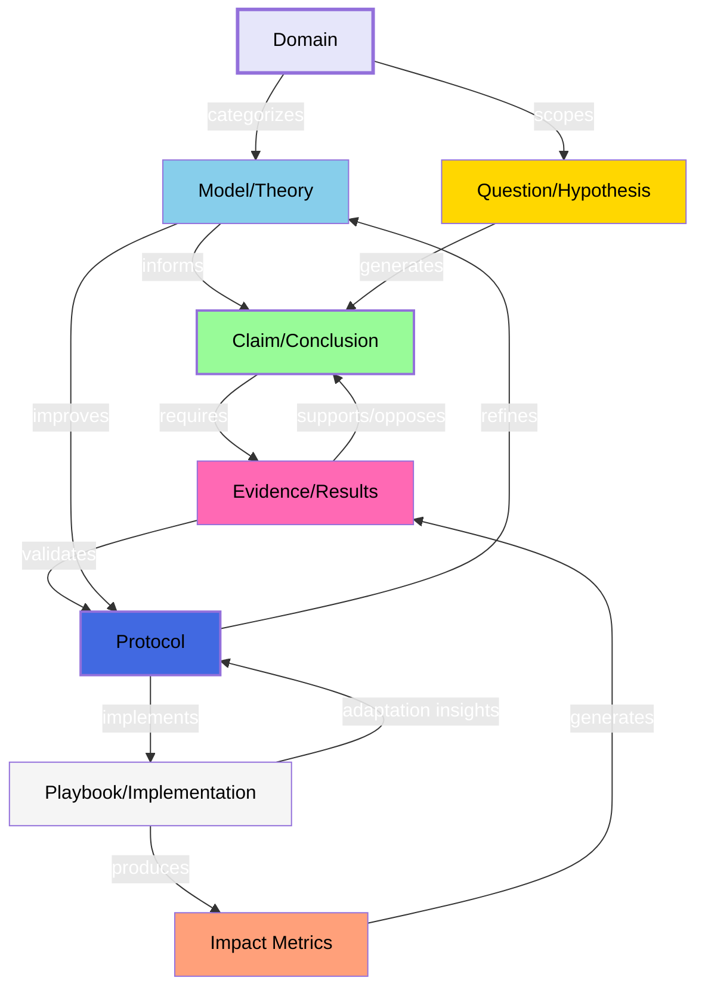

# Discourse Graphs for Open Civics Knowledge Commons

## Executive Summary

OpenCivics envisions a society where citizens transform from passive consumers into active stewards of our planet, communities, and commons. Central to this vision is the development of [**open protocols**](/OpenProtocols). This proposal outlines how <a href="https://scalingsynthesis.com/q-what-is-a-decentralized-discourse-graph/" target="_blank">**decentralized discourse graphs**</a> can be integrated into OpenCivics' Knowledge Commons Protocol to enhance collective knowledge building, support the propagation of open protocols, and facilitate the evolutionary adaptation of our civilizational systems. By emphasizing decentralization and democratization, we ensure that knowledge networks become true commons, accessible and contributable by all.

## Introduction

### The Metacrisis and OpenCivics' Vision for Open Protocols

In the face of an existential metacrisis, humanity must reimagine itself as an intrinsic part of the living world, responsible for the vitality of our planet and communities. OpenCivics proposes an approach where civic infrastructures localize and distribute resources and decision-making via open, participatory mechanisms. This necessitates the development of [open protocols](/OpenProtocols)—patterns of human coordination that function as civilizational services using a networked approach.

### The Need for Decentralized Discourse Graph<sup>[4]</sup>

To effectively develop and propagate open protocols, we require a decentralized, democratized method for mapping and [synthesizing](https://scalingsynthesis.com/q-what-is-synthesis/)  collective knowledge. <a href="https://scalingsynthesis.com/q-what-is-a-decentralized-discourse-graph/" target="_blank">**Decentralized discourse graphs**</a> offer a solution by enabling bottom-up knowledge creation across multiple domains through interconnected nodes and relationships. By decentralizing the synthesis process, we distribute responsibilities among diverse participants, reflecting OpenCivics' commitment to inclusivity and collective stewardship.

## Discourse Graphs Explained

### What Are Discourse Graphs?

<figure>
  </img>
  <figcaption>
    <small>
      <a href="https://ask.pubpub.org/about" target="_blank">Source: A Discourse Graph primer</a>
    </small>
  </figcaption>
</figure>

[Discourse graphs](https://ask.pubpub.org/about) are data structures that represent knowledge as a network of interconnected nodes—such as questions, claims, evidence, protocols, and playbooks—and relationships like supports or opposes. This granular approach aligns with the needs of open protocol development by:

- Allowing for detailed mapping of complex ideas.
- Supporting modularity and reuse of knowledge components.
- Facilitating decentralized contribution and iterative refinement.
- Enabling democratized participation where knowledge is treated as a commons.

The concept of discourse graphs as a structured approach to organizing knowledge has evolved over time, with different variants emerging to suit various needs and contexts. The discourse graph model described above is based on conventions proposed by Joel Chan. However, adaptations have developed in other academic fields, reflecting unique terminologies and practices.

For instance, biologist Matt Akamatsu's *Results Graph* modifies the discourse graph model to align with experimental science. In this model, experiments yield data that either supports or opposes specific conclusions and generates new hypotheses. This structure reflects the iterative nature of scientific inquiry, where hypotheses motivate further experimentation, and experimental conclusions contribute to our evolving scientific theories and models of the world.

<figure>
  </img>
  <figcaption>
    <small>
      <a href="https://ask.pubpub.org/about" target="_blank">Source: A Discourse Graph primer</a>
    </small>
  </figcaption>
</figure>

In this Open Civics community, there is a unique opportunity to explore synthesis loops: how iterative experimentation, civic theory-building, and collaborative frameworks can be visually and structurally represented within discourse graphs to deepen our understanding of decentralized civilizational systems. Beyond conventional discourse and results graph ontologies, we might consider how implementations of protocols—each as an experiment in civic design—could generate evidence to support or refine civic hypotheses, thereby motivating further experimentation and adaptations across regions or contexts.

By modeling these dynamic feedback loops, Open Civics could create a system where civic interactions, open-source frameworks, and commons governance principles form an evolving network of “extitutions” (external, open organizations). Protocol implementations in one community would contribute insights and potential adaptations for others, with incentives aligned to promote cascading benefits within the commons. In this way, the synthesis loop approach could serve as both a roadmap and engine for continuous learning and adaptation within decentralized civic systems.

### Modified Graph with Protocols & Playbooks

The diagram illustrates the interconnected nature of knowledge in our civic protocol development system. Rather than purely top-down, it represents a bidirectional flow where knowledge can emerge from both theoretical frameworks and practical implementations. This aligns with the DIKW (Data-Information-Knowledge-Wisdom) framework, where each level builds upon and enriches the others:

1. Emergent Knowledge Creation:
- Raw data and information from implementations (Playbooks & Impact Metrics)
- Knowledge synthesis through Evidence and Claims
- Understanding through Models/Theories
- Wisdom in determining appropriate Domains and Questions
2. Synthesis Loops:
- Ground-up Learning: Practical implementations generate data and insights
- Knowledge Integration: Evidence from multiple sources validates or challenges existing understanding
- Theory Evolution: Real-world experience informs and reshapes theoretical models
- Wisdom Development: The synthesis process helps identify "what is best" for different contexts
3. Bidirectional Flow:
- Bottom-up: Practical experience → Evidence → Claims → Theory
- Top-down: Theory → Protocols → Implementations
- Continuous interplay between theory and practice
This structure embraces both emergent knowledge creation and theoretical guidance while maintaining clear relationships between different types of knowledge. The synthesis loops ensure that practical wisdom emerges from collective experience, while theoretical understanding helps guide new implementations.

### Node Types and Their Schemas

#### Protocol Nodes

Protocols are general guidelines not tied to a specific locality. They are openly documented and freely available for anyone to use, implement, and modify.

```yaml
---
type: protocol
id: [protocol-id]
author: [author-id]
contributors:
  - [contributor-id]
relationships:
  - related_to: [node-id]
---
**Objective:** [Describe the purpose and goal of the protocol.]

**Scope:** [What's included and excluded in the protocol.]

**Procedures:** [Step-by-step instructions to achieve the objective.]

**Roles and Responsibilities:** [Who is responsible for each action within the procedures.]

**Materials and Equipment:** [What’s required to carry out the procedures.]

**Guidelines:** [Suggested considerations while conducting procedures.]

**Documentation:** [Suggestions on how to document the outcomes of the procedures.]
```

#### Playbook Nodes

Playbooks document the use or implementation of a protocol in a specific context or locality. They capture adaptations and practical applications.

```yaml
---
type: playbook
id: [playbook-id]
author: [author-id]
contributors:
  - [contributor-id]
protocol: [protocol-id]
locality: [bioregion or domain]
relationships:
  - implements: [protocol-id]
  - supports: [node-id]
  - opposes: [node-id]
permissions:
  read: public | group
  write: public | group
---
[Detailed documentation of how the protocol was implemented, including any adaptations or outcomes.]
```

#### Other Node Types

- **Question Nodes:** Pose questions or challenges.
- **Claim Nodes:** Present assertions or proposals.
- **Evidence Nodes:** Provide supporting or opposing information.
- **Other:** Topics, Experiments, Models..

### Decentralizing the Discourse Graph

Decentralization of discourse graphs means:

- **Distributed Contribution:** Allowing anyone to add to the knowledge base.
- **Role Diversification:** Encouraging participants to take on various roles such as researchers, annotators, validators, and synthesizers.
- **No Central Authority:** Eliminating centralized control over knowledge synthesis and validation.
- **Local Autonomy:** Supporting bioregional and domain-specific knowledge commons managed by local experts or communities.

### Community Roles in a Decentralized Knowledge Graph

To facilitate decentralization, we recognize the need for diverse community roles:

1. **Primary Researchers:** Contribute original research and data.
2. **Synthesizers:** Formalize and connect research into coherent frameworks.
3. **Annotators:** Read and annotate content, making meaningful connections across fields.
4. **Validators:** Evaluate contributions to improve the signal-to-noise ratio.
5. **Facilitators:** Help determine meaningful directions for exploration and prioritize content.
6. **Stewards:** Manage specific knowledge domains or bioregional commons, ensuring local relevance.

By dividing responsibilities, we reduce individual burdens and encourage broader participation.

## Alignment with OpenCivics' Objectives

<details>
<summary> Decentralized Collaboration and Democratization</summary>

- **Inclusivity:** By decentralizing the discourse graph, we empower a diverse range of participants to contribute, reflecting the democratized ethos of OpenCivics.
- **Commons-Based Approach:** Knowledge networks become a shared resource, accessible and contributable by all, embodying the principles of a knowledge commons.
- **Stigmergic Coordination:** Decentralized contributions lead to emergent patterns of organization without centralized control.
</details>

<details>
<summary> Addressing Human Behavior Challenges</summary>

- **Lowering Barriers to Entry:** By allowing participants to contribute in various capacities based on their interests and strengths, we accommodate varying levels of engagement.
- **Encouraging Participation:** Implementing mechanisms such as reputation systems, rewards, or acknowledgment can motivate contributions.
- **Reducing Complexity:** Providing user-friendly tools and interfaces makes it easier for participants to engage without becoming overwhelmed.
</details>

<details>
<summary> Supporting Localized Knowledge Commons</summary>

- **Bioregional Knowledge Commons:** Allow communities to manage knowledge relevant to specific regions, fostering local autonomy and relevance.
- **Domain-Specific Graphs:** Experts can oversee knowledge graphs in specialized domains, ensuring accuracy and depth.
</details>

## Technical Implementation

### Document Structure with Decentralization in Mind

Each markdown file represents a node in the discourse graph, defined by frontmatter metadata.

#### Protocol Nodes (No Locality)

```yaml
---
type: protocol
id: [protocol-id]
author: [author-id]
contributors:
  - [contributor-id]
relationships:
  - related_to: [node-id]
---
[Protocol content following the OpenCivics protocol schema.]
```

#### Playbook Nodes (With Locality)

```yaml
---
type: playbook
id: [playbook-id]
author: [author-id]
contributors:
  - [contributor-id]
protocol: [protocol-id]
locality: [bioregion or domain]
relationships:
  - implements: [protocol-id]
  - supports: [node-id]
  - opposes: [node-id]
permissions:
  read: public | group
  write: public | group
---
[Playbook content detailing the implementation of the protocol in a specific context.]
```

#### Other Nodes

- **Question Nodes:**

  ```yaml
  ---
  type: question
  id: [question-id]
  author: [author-id]
  contributors:
    - [contributor-id]
  relationships:
    - related_to: [node-id]
  ---
  [Question text.]
  ```

- **Claim Nodes:**

  ```yaml
  ---
  type: claim
  id: [claim-id]
  author: [author-id]
  contributors:
    - [contributor-id]
  relationships:
    - supports: [node-id]
    - opposes: [node-id]
  ---
  [Claim text.]
  ```

- **Evidence Nodes:**

  ```yaml
  ---
  type: evidence
  id: [evidence-id]
  author: [author-id]
  contributors:
    - [contributor-id]
  relationships:
    - supports: [node-id]
    - opposes: [node-id]
  ---
  [Evidence content.]
  ```

### Decentralized Query Capabilities

Using distributed tools and decentralized platforms, we enable dynamic queries without relying on centralized servers.

- **Peer-to-Peer Networks:** Utilize networks like IPFS and OriginTrail for hosting and sharing the discourse graph.
- **Local-First Software:** Encourage the use of applications that work offline and synchronize when possible.
- **Federated Queries:** Allow queries to span across multiple nodes or instances, supporting a federated approach.

### Integration with Decentralized Tools

- **Version Control:** Use decentralized version control systems like git and TerminusDB.
- **Publishing Platforms:** Leverage decentralized web technologies for hosting content.
- **Editing Tools:** Promote the use of open-source, decentralized editors.
- **Contribution Mechanisms:** Implement systems that allow for merging contributions without central gatekeepers.

### Integration with Semantic Web Standards

The discourse graph structure naturally aligns with semantic web standards, enabling interoperability across different knowledge representation formats:

<details>
<summary>RDF Compatibility</summary>

- **Natural Mapping:** Discourse graph nodes and relationships map directly to RDF subject-predicate-object triples
- **Flexible Serialization:** Content can be represented in various formats (Markdown+frontmatter, JSON-LD, RDF/XML) while maintaining semantic meaning
- **Vocabulary Alignment:** Node types and relationships can be defined using standard RDF vocabularies or custom ontologies

Example of a Protocol node in JSON-LD:
```json
{
  "@context": {
    "@vocab": "http://opencivics.org/ns/",
    "dc": "http://purl.org/dc/terms/"
  },
  "@type": "Protocol",
  "@id": "protocol-qf",
  "dc:creator": "user111",
  "dc:contributor": ["user222"],
  "relationship": {
    "@type": "RelatedTo",
    "@id": "node-123"
  }
}
```
</details>


## Supporting Progressive Protocolization in a Decentralized Context

### Stage 1: Conception and Gestation

- **Distributed Questioning:** Encourage diverse participants to pose questions relevant to their contexts.
- **Community Claims:** Allow communities to document their approaches without needing centralized approval.
- **Shared Evidence Collection:** Participants contribute evidence from varied sources, enriching the collective understanding.

### Stage 2: Maturation

- **Collaborative Specification:** Diverse contributors propose and refine protocol specifications.
- **Hybrid Implementations:** Communities experiment with implementations, sharing results openly.
- **Decentralized Relationships:** Relationships between nodes form organically based on contributions.

### Stage 3: Reproduction and Decomposition

- **Local Adaptations:** Communities modify protocols to suit their needs, documenting changes in playbooks.
- **Forking and Merging:** Protocols evolve through forking (creating variants) and merging (combining improvements), akin to open-source software development.
- **Cross-Pollination:** Communities learn from each other's adaptations, fostering innovation.

## Addressing Challenges in Decentralized Knowledge Building

### Overcoming Human Behavior Obstacles

- **Lazy Participation:** Design the system to capture passive contributions, such as implicit data from reading habits or lightweight annotations.
- **Complexity Management:** Provide tools that simplify interaction with the discourse graph, preventing cognitive overload.
- **Incentivization:** Implement social or token-based incentives to encourage active participation.

### Ensuring Quality and Reliability

- **Reputation Systems:** Allow users to build reputations based on their contributions, enhancing trust.
- **Peer Review Mechanisms:** Enable community validation of nodes and relationships.
- **Conflict Resolution:** Establish protocols for addressing conflicting information or disputes.

### Supporting Diverse Contribution Levels

- **Role Flexibility:** Allow participants to fluidly move between roles based on interest and capacity.
- **Accessibility:** Ensure the platform is accessible to users with varying technical abilities.
- **Education and Onboarding:** Provide resources to help new participants understand how to contribute effectively.

## Practical Applications

### Example: Quadratic Funding in the Cascadia Bioregion

**Question Node:**

```yaml
---
type: question
id: qf-001
author: "user789"
contributors:
  - "user101"
relationships:
  - related_to: [protocol-id for quadratic funding]
---
How can quadratic funding be effective for funding a synergistic set of projects in the Cascadia Bioregion?
```

**Protocol Node (Quadratic Funding):**

```yaml
---
type: protocol
id: protocol-qf
author: "user111"
contributors:
  - "user222"
relationships:
  - related_to: [node-id]
---
**Objective:** To democratize funding allocation by matching community contributions with a funding pool based on the quadratic funding mechanism.

**Scope:** Applicable to public goods projects seeking community support. Excludes projects that do not meet public goods criteria.

**Procedures:**
1. Projects submit proposals for funding.
2. Community members contribute funds to preferred projects.
3. Total contributions are matched from a funding pool using the quadratic funding formula.

**Roles and Responsibilities:**
- **Project Owners:** Submit proposals and engage with the community.
- **Community Members:** Contribute funds to projects.
- **Funding Pool Stewards:** Manage the matching funds and oversee the allocation process.

**Materials and Equipment:** Online platform for submissions and contributions.

**Guidelines:** Ensure transparency in contributions and allocations.

**Documentation:** Maintain records of contributions, matching calculations, and project outcomes.
```

**Playbook Node (Cascadia Implementation):**

```yaml
---
type: playbook
id: playbook-qf-cascadia
author: "user333"
contributors:
  - "user444"
protocol: protocol-qf
locality: "Cascadia Bioregion"
relationships:
  - implements: protocol-qf
  - supports: qf-001
permissions:
  read: public
  write: group
---
**Implementation Details:**

We adapted the quadratic funding protocol for the Cascadia Bioregion to support environmental sustainability projects.

**Adaptations:**

- **Local Currency Integration:** Accepted contributions in a regional currency to encourage local economic circulation.
- **Project Criteria:** Focused on projects that enhance ecological resilience.

**Outcomes:**

- Funded 15 projects with strong community engagement.
- Achieved a matching pool utilization rate of 90%.

**Lessons Learned:**

- Community education on quadratic funding increased participation.
- Local currency acceptance boosted contributions by 25%.

**Future Recommendations:**

- Expand outreach to underrepresented communities.
- Consider periodic funding rounds to maintain momentum.
```

**Queries:**

Participants can run queries to gain insights, for example using Obsidian's dataview feature.
<details>
<summary> Example Query</summary>
```dataview
// Find all playbooks implementing the quadratic funding protocol in Cascadia, ranked by outcomes
TABLE
  playbook.id as "Playbook ID",
  playbook.author as "Author",
  playbook["Outcomes"] as "Outcomes",
  playbook["Lessons Learned"] as "Lessons Learned",
  contributors,
  locality
FROM "playbooks" as playbook
WHERE playbook.protocol == "protocol-qf" AND playbook.locality == "Cascadia Bioregion"
SORT playbook["Outcomes"]["Matching Pool Utilization"] DESC
```

**Explanation:** 
- **Purpose:** Retrieve playbooks that implemented the quadratic funding protocol in the Cascadia Bioregion.
- **Outcomes Analysis:** Examine the effectiveness based on metrics like matching pool utilization.
- **Insights Gained:** Identify successful adaptations and areas for improvement.
</details>

## Implementation Plan

### Steps Forward

<details>
<summary> 1. Establish Decentralized Infrastructure</summary>

   - Set up peer-to-peer networks and decentralized storage solutions.
   - Develop protocols for data synchronization and conflict resolution.
</details>
<details>
<summary> 2.  Define Community Roles</summary>

   - Clearly outline roles and responsibilities to encourage participation.
   - Provide guidelines and tools tailored to each role.
</details>
<details>
<summary> 3.  Develop User-Friendly Tools</summary>

   - Create interfaces that simplify interaction with the discourse graph.
   - Ensure accessibility across different devices and platforms.
</details>
<details>
<summary> 4.  Pilot Projects</summary>

   - Initiate pilot programs in selected bioregions or domains.
   - Gather feedback to refine processes and tools.
</details>
<details>
<summary> 5.  Community Engagement</summary>

   - Conduct outreach to educate potential participants.
   - Facilitate workshops and training sessions.
</details>
<details>
<summary> 6.  Iterative Development</summary>

   - Continuously improve based on user feedback and technological advancements.
   - Encourage open-source contributions to tool development.
</details>

### Success Metrics

1. **Participation Rates:** Measure the diversity and number of contributors.
2. **Decentralization Level:** Assess the distribution of data and control.
3. **Community Satisfaction:** Gather feedback on usability and impact.
4. **Protocol Evolution:** Track how protocols adapt and improve over time.
5. **Knowledge Diversity:** Evaluate the range of knowledge domains and regions represented.

## Conclusion

Integrating decentralized discourse graphs into OpenCivics' Knowledge Commons Protocol aligns with our core principles of decentralization, democratization, and collective stewardship. By distributing responsibilities and empowering diverse participation, we create a resilient and inclusive knowledge network that serves as a true commons. This approach not only enhances the development and propagation of open protocols but also embodies the transformative vision of reimagining ourselves as active stewards of our planet and communities. Together, we can harness the collective intelligence needed to address the existential challenges of our time.

## References

[1] [The Society Library Debate Mapping Program](https://www.societylibrary.org/debate-mapping-program)<br/>
[2] [Discourse Graphs and the Future of Science](https://research.protocol.ai/blog/2023/discourse-graphs-and-the-future-of-science/)<br/>
[3] [Mapping Investments in Scientific Public Goods](https://youtu.be/P0KUt2yrUkw)<br/>
[4] [Decentralized Discourse Graphs](https://scalingsynthesis.com/q-what-is-a-decentralized-discourse-graph/)
