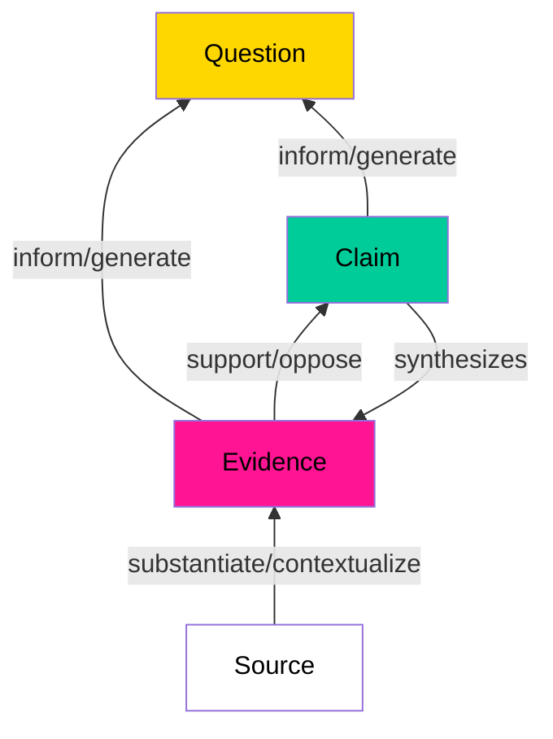
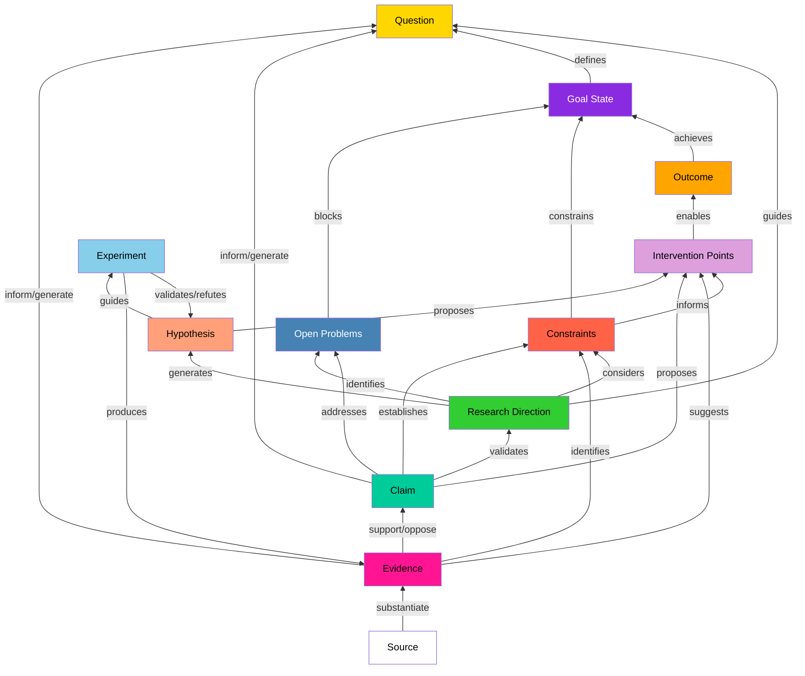

Decentralized Science (DeSci) seeks to address issues in traditional scientific practices around funding, publishing, and collaboration. Discourse graphs provide an elegant framework that can support the full spectrum of scientific work - from synthesizing existing research to mapping out and funding new frontiers.
## Why Do We Need New Tools?

The traditional scientific process faces several challenges:
- Research collaboration is disincentivized by the "first author claims all" paradigm
- High-quality experimental work often goes uncredited when it's "just" supporting other papers
- Traditional publication methods delay sharing valuable insights until a complete narrative is formed
- Current knowledge systems can't effectively map the functions of scientific knowledge to specific societal outcomes
- Research funding lacks efficient markets for impact and risk-taking
- Effective synthesis of scientific knowledge is rare and published syntheses are scarce and almost never updated [Chan, 2021]
- The process of synthesizing research is extremely time-consuming and arduous for individual researchers [Chan, 2021]

## Graph-Based Science: From Simple to Sophisticated

### A Foundation: [Discourse graphs](https://ask.pubpub.org/about)

At their core, discourse graphs provide a simple yet powerful framework:
- Questions that drive inquiry
- Claims that propose answers
- Evidence that supports claims
- Clear links between these elements
- Granular representation at the claim level while preserving crucial context
- Ability to decompose complex arguments while maintaining connections to supporting evidence [Chan, 2021]

This simple structure enables:
- Early sharing of progress
- Building upon others' work effectively
- Tracking contributions transparently
- Facilitating decentralized coordination and peer review
- Understanding and properly interpreting findings across different domains

### An Extension: Research Roadmapping

The basic discourse graph framework can be extended to accomodate discourse in various aspects of science, for example a goal-oriented model for research roadmapping. This extension might add several key capabilities:

1. **Goal-Oriented Structure**
   - Define clear goal states and their essential properties
   - Map pathways from current knowledge to desired outcomes
   - Identify constraints and potential solutions
   - Track both technical and commercial viability

2. **Strategic Elements**
   - Open problems blocking progress
   - Research directions and approaches
   - Market constraints and opportunities
   - Logical relationships (AND/OR) between elements

3. **Applied Science Coordination**
   - Track market and scientific research findings
   - Enable cross-domain communication
   - Support venture creation
   - Identify non-obvious intervention points

### Integration with Web3

DeSci Discourse Graphs can naturally integrate with Web3 in key ways:

**Impact Certificates**
   - Researchers can issue certificates for proposed initiatives
   - Claims in certificates supported by discourse graphs
   - Roadmaps identify high-leverage funding opportunities
   - Enable transparent markets for scientific impact
   - Support risk-sharing across multiple funders

**Decentralized Knowledge Graphs**

- Host discourse graphs on decentralized infrastructure like the <a href="https://origintrail.io/blog/announcing-the-id-theory-desci-ipo-initial-paranet-offering" target="_blank">DeSci Knowledge Graph</a> on OriginTrail
- Ensure knowledge is discoverable, verifiable, and properly attributed
- Enable AI services to interact with verified knowledge without hallucination
- Support knowledge mining and incentivization through tokens
- Create foundation for autonomous research agents

The combination of discourse graphs with OriginTrail's DeSci Knowledge Graph creates powerful new capabilities:

1. Automated Knowledge Mining

   • AI services process scientific papers into initial discourse graphs
   
   • Knowledge miners validate and refine AI-generated discourse
   
   • Progressive improvement of automated parsing via feedback loops
   
   • Preservation of attribution and provenance through transformation chains

2. Verifiable Knowledge Integration

   • Clear tracking of knowledge origins and transformations

   • Support for both symbolic and neural AI capabilities

   • Creation of trusted foundations for autonomous research

3. Enhanced AI Services

   • Structure-aware scientific chat interfaces that can:
      - Navigate between claims, evidence, and questions naturally
      - Explain the chain of reasoning behind scientific conclusions
      - Identify gaps in evidence or logical connections
      - Generate targeted research questions based on knowledge gaps

   • Improved retrieval-augmented generation (dRAG) through:
      - Context-aware citation of supporting evidence
      - Clear distinction between claims and evidence in responses
      - Ability to traverse related research across domains
      - Generation of structured knowledge from conversations

4. Collaborative Knowledge Mining

   • Enhanced mining incentives through:
      - Rewards for creating high-quality discourse structures
      - Bonuses for connecting previously isolated knowledge areas
      - Recognition for identifying key claims and evidence
      - Incentives for validating AI-generated structures

   • Peer review mechanisms:
      - Validation of claim-evidence relationships
      - Assessment of cross-domain connections
      - Tracking of knowledge reuse and impact

This integration creates a foundation for truly autonomous scientific research, where AI agents can:
- Navigate verified scientific knowledge
- Generate testable hypotheses
- Design experimental protocols
- Synthesize findings across domains
- Propose new research directions
- While maintaining clear provenance and attribution

### Integration Across Knowledge Domains
Discourse graphs enable seamless connection between scientific knowledge and other domains. The integration with civic knowledge commons demonstrates this potential:

**Example: [Civic Knowledge Commons](DiscourseGraphs)**

   - Enable bottom-up knowledge creation through community participation
   - Bridge specialized research with practical applications
   - Support evidence-based development of societal infrastructure
   - Create bidirectional knowledge flow between experts and practitioners
   - Transform siloed processes into participatory models

This pattern could be replicated across domains - from environmental management to public health to education. The structure of discourse graphs allows different knowledge communities to maintain their specific contexts while creating clear interfaces for collaboration, making knowledge more accessible and actionable while preserving rigor.

## Cross-Domain Integration
Discourse graphs offer a powerful solution to one of science's greatest challenges: the increasing specialization and fragmentation of knowledge. While specialization has driven scientific progress, it has also created silos that make it difficult to address complex, interdisciplinary challenges. Discourse graphs can help bridge these divides by:

- Representing knowledge at the claim level, making it easier to connect related ideas across different domains
- Preserving crucial context that helps researchers understand and properly interpret findings from other fields
- Enabling exploration of connections that might be missed in traditional keyword-based searches, as discourse graphs go beyond simple keyword matching that requires shared terminology [Chan, 2021]
- Supporting the synthesis of knowledge across disciplinary boundaries to address complex societal challenges
- Overcoming the limitations of traditional search methods that rely on stable, shared understanding of terminology across fields [Chan, 2021]

This framework is particularly valuable as we face increasingly complex challenges that require integrating insights from multiple scientific domains. The ability to synthesize research across all of science is crucial for addressing the needs of the day and the goals of tomorrow.

## Summary of Key Benefits

The integration of discourse graphs, Web3, and AI creates three fundamental advantages for decentralized science:
1. Enhanced Knowledge Organization and Discovery

   • Structured representation of scientific claims and evidence enables more effective knowledge synthesis

   • Cross-domain integration supports discovery of non-obvious connections

   • AI-assisted navigation and analysis of complex research landscapes

   • Preservation of crucial context and provenance for scientific claims

2. Improved Research Coordination and Planning

   • Goal-oriented roadmaps connect research efforts to desired outcomes

   • Clear identification of critical pathways, bottlenecks, and intervention points

   • Strategic alignment of technical development with market opportunities

   • Enhanced ability to track progress and measure contribution significance

   • Support for specialized labor and expertise across complex projects

3. Market-Driven Innovation and Impact

   • Transparent attribution and valuation of scientific contributions

   • Efficient markets for research outcomes through impact certificates

   • Risk-sharing mechanisms for ambitious research initiatives

   • Market-based discovery of high-leverage opportunities

   • Incentivization of crucial but traditionally undervalued work like synthesis and replication

These benefits create a foundation for a more effective, collaborative, and impact-driven scientific ecosystem. By addressing the core challenges of traditional scientific practice while enabling new capabilities, discourse graphs and their extensions provide a framework for truly decentralized science.

## Moving Forward

To advance graph-based DeSci, we need:

1. **Core Framework Development**
   - Refine the basic discourse graph structure
   - Create standards for extensions
   - Develop best practices for different use cases
   - Address the challenges of synthesizing knowledge across disciplines

2. **Tool Development**
   - Build flexible platforms supporting the core framework and extensions
   - Create user-friendly interfaces
   - Enable impact tracking and attribution
   - Support certificate issuance and trading
   - Develop tools that reduce the individual overhead of synthesis work

3. **Market Development**
   - Create efficient markets for impact certificates
   - Develop risk-sharing mechanisms
   - Build tools for impact evaluation
   - Enable proper valuation of synthesis work and cross-domain integration

4. **Community Building**
   - Foster collaboration between researchers and funders
   - Share best practices across domains
   - Create spaces for experimental funding models
   - Encourage and reward cross-disciplinary synthesis efforts

The future of science is decentralized, and graph-based knowledge systems provide a flexible, extensible framework for making that future a reality. By starting with the simple, universal structure of discourse graphs and extending for various functions of science such as research roadmapping, we can create a more effective, collaborative, and impact-driven scientific ecosystem that properly incentivizes and rewards ambitious research while facilitating crucial cross-domain synthesis.

---
References:
- "Discourse Graphs and the Future of Science" (https://research.protocol.ai/blog/2023/discourse-graphs-and-the-future-of-science/)
- "The Outcomes Graph: A Protocol for Applied Science Coordination" (https://deepscienceventures.com/content/the-outcomes-graph-2)*
- Chan, J. (2021). "Discourse Graphs for Augmented Knowledge Synthesis: What and Why"*