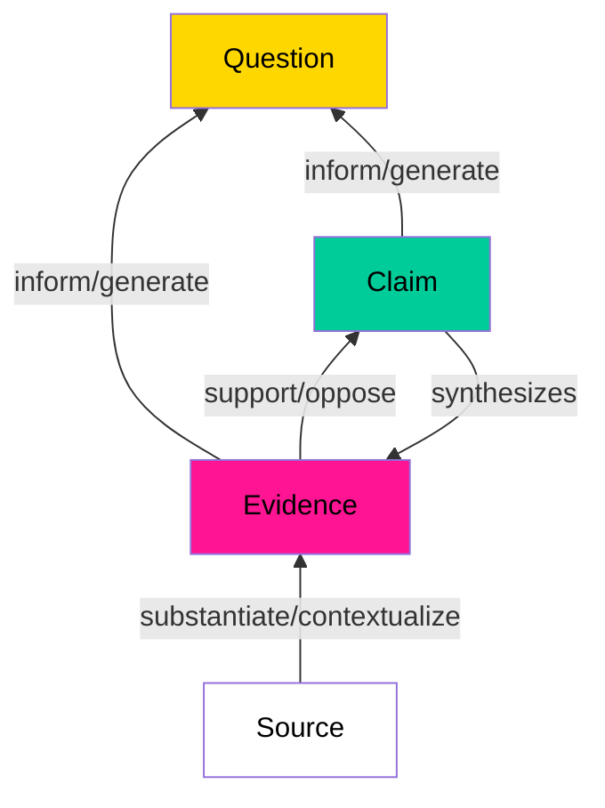
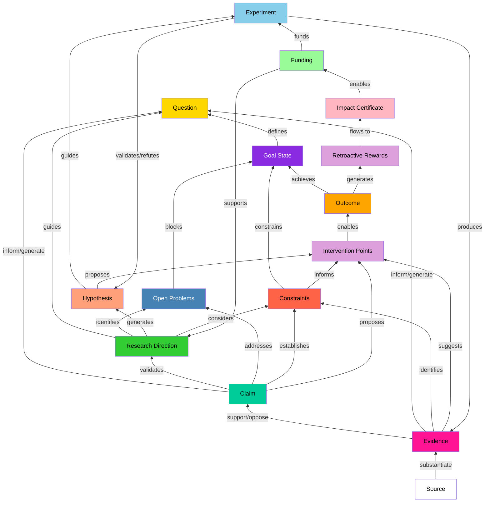

Decentralized Science (DeSci) seeks to address issues in traditional scientific practices around funding, publishing, and collaboration. Discourse graphs provide an elegant framework that can support the full spectrum of scientific work - from synthesizing existing research to mapping out and funding new frontiers.
## Why Do We Need New Tools?

The traditional scientific process faces several challenges:
* Research collaboration is disincentivized by the "first author claims all" paradigm
* High-quality experimental work often goes uncredited when it's "just" supporting other papers
* Traditional publication methods delay sharing valuable insights until a complete narrative is formed
* Research funding lacks efficient markets for impact and risk-taking
* Synthesis of scientific knowledge is rare, time-consuming, and arduous for individual researchers [Chan, 2021]
* Increasing specialization creates silos, making it difficult to interpret findings across domains
* Limited search capabilities hamper discovery across fields due to terminology differences

## Graph-Based Science: From Simple to Sophisticated

[Discourse graphs](https://ask.pubpub.org/about) provide an elegent framework for structuring and sharing scientific arguments:
- Questions that drive inquiry
- Claims that propose answers
- Evidence that supports claims
- Clear links between these elements
- Granular representation at the claim level while preserving crucial context
- Ability to decompose complex arguments while maintaining connections to supporting evidence [Chan, 2021]

This simple structure enables:
- Early sharing of progress
- Building upon others' work effectively
- Tracking contributions transparently
- Facilitating [decentralized coordination](https://scalingsynthesis.com/q-what-is-a-decentralized-discourse-graph/) and peer review
- Understanding and properly interpreting findings across different domains

*Example discourse graph for the question: Are bans an effective way to mitigate antisocial behavior in online forums? (Source: Joel Chan)*

### From Knowledge Synthesis to Full Research Lifecycle

Discourse graphs currently focus on two primary functions:
1. **Knowledge Synthesis and Sharing**
   - Structured representation of scientific claims and evidence
   - Facilitating literature review and gap analysis
   - Accelerating researcher onboarding through structured knowledge
   - Supporting cross-domain discovery and integration

2. **Open-source, Modular Research Communication**
   - Breaking research into discrete, reusable units (questions/claims/evidence)
   - Enabling collaborative, iterative research development
   - Supporting transparent attribution of contributions
   - Facilitating discovery of collaboration opportunities

The basic discourse graph framework can be extended to accommodate the entire scientific process, particularly through goal-oriented models like the Outcomes Graph. This extension adds several key capabilities:

1. **Goal-Oriented Structure**
   - Define clear goal states as positive statements of capability or achievement
   - Map pathways from current knowledge to desired outcomes
   - Identify and categorize constraints and potential solutions:
     - Constraints: Known impossible outcomes with complete understanding
     - Solutions: Known possible outcomes with high understanding
     - Hypothesized constraints: Potentially impossible outcomes with low understanding
     - Hypothesized solutions: Potentially possible outcomes with low understanding
   - Track both technical and commercial viability through evidenced discussions

2. **Strategic Elements**
   - Open problems blocking progress
   - Research directions and approaches
   - Market constraints and opportunities
   - Logical relationships (AND/OR) between outcomes that determine:
     - Necessity: How uniquely an outcome enables other outcomes
     - Sufficiency: The degree to which an outcome enables others by itself
   - Evidence tracking for all claims and relationships

3. **Applied Science Coordination**
   - Track market and scientific research findings
   - Enable cross-domain communication through structured knowledge representation
   - Support venture creation by identifying:
     - Areas of neglect (fewer existing companies)
     - Opportunities for combinatorial innovation
     - Critical pathways and bottlenecks
   - Map optimal paths to achieving high-impact ventures
   - Identify non-obvious intervention points through knowledge combination

This evolution enables discourse graphs to support:
- Research planning and coordination through structured outcome mapping
- Funding allocation and impact tracking based on necessity and sufficiency
- Collaborative research execution with clear attribution of contributions
- Knowledge synthesis and sharing across domains
- Research communication and discovery
- Rapid assembly of expertise for specific challenges
- Fair allocation of funding based on expertise and contribution profiles

By supporting the full research lifecycle in one integrated framework, discourse graphs help create a more efficient and collaborative scientific ecosystem that can effectively move the knowledge frontier forward through venture creation.

### Integration with Decentralized Finance, Knowledge Management, and AI

DeSci Discourse Graphs create a unified framework integrating financial incentives, knowledge management, and AI capabilities:

#### 1. Decentralized Financial Infrastructure

**Embedded Funding Markets Through [Impact Certificates](https://www.punkrockbio.com/p/exploring-impact-certificates)**
1. **Knowledge-Driven Funding**
   - Impact certificates issued based on research directions identified in discourse graphs
   - Clear mapping between funding opportunities and scientific frontiers
   - Transparent connection between investments and expected outcomes
   - Natural integration with IP NFTs and other tokenized research assets

2. **Funding Intelligence**
   - Replicates VC's successful distributed intelligence model for public goods 
      - "What if impact certificates could be the non-profit version of stock certificates?" - Juan Benet
   - Multiple layers of funders can specialize in different aspects of research
   - Enables efficient matching of capital with domain expertise
   - Creates feedback loops between outcomes and future funding decisions

3. **Retroactive Reward Systems**
   - Impact certificate holders receive rewards based on verified outcomes
   - Clear attribution of value through discourse graph connections
   - Incentivizes early funding of promising research directions
   - Supports long-term research through outcome-based compensation

**Token-Based Incentives**
- Rewards for high-quality discourse structures
- Bonuses for connecting isolated knowledge areas
- Recognition for identifying key claims and evidence
- Incentives for validating AI-generated structures
- Markets for knowledge mining and curation

#### 2. Decentralized Knowledge Management

**Knowledge Graph Infrastructure**
- Host discourse graphs on decentralized networks (e.g., <a href="https://origintrail.io/blog/announcing-the-id-theory-desci-ipo-initial-paranet-offering" target="_blank">DeSci Knowledge Graph</a>)
- Ensure knowledge is discoverable, verifiable, and properly attributed
- Support knowledge mining and incentivization through tokens
- Create foundation for autonomous research agents

**Enhanced Peer Review Mechanisms**
1. Granular Review Scope
   - Individual claims can be challenged or supported independently
   - Researchers focus expertise on specific aspects
   - Validation of claim-evidence relationships
   - Assessment of cross-domain connections

2. Constructive Addition
   - Peers extend work by adding supporting evidence
   - Reproduction attempts tracked and linked to claims
   - Failed reproductions become valuable data points
   - Alternative interpretations coexist with clear evidential support

3. Dynamic Validation
   - Real-time updates as new evidence emerges
   - Clear tracking of reliability through reproduction attempts
   - Tracking of knowledge reuse and impact
   - Transparent resolution of conflicting evidence

#### 3. AI Integration and Knowledge Translation

**Automated Knowledge Processing**
- AI services process papers into initial discourse graphs
- Knowledge miners validate and refine AI-generated discourse
- Progressive improvement through feedback loops
- Preservation of attribution and provenance

**Multi-Audience Knowledge Translation**
- Technical summaries for domain experts
- Simplified explanations for adjacent fields
- Public-facing narratives for broader impact
- Policy-relevant briefings for decision makers
- Maintains links to technical details and evidence
- Enables exploration at multiple levels of detail

**Advanced AI Services**
- Structure-aware scientific chat interfaces
- Natural navigation between claims, evidence, and questions
- Chain of reasoning explanation
- Gap identification and question generation
- Context-aware citation and evidence distinction
- Cross-domain knowledge traversal

This integrated system creates a foundation for autonomous scientific research, where AI agents can:
- Navigate verified scientific knowledge
- Generate testable hypotheses
- Design experimental protocols
- Synthesize findings across domains
- Propose new research directions
- Communicate findings to diverse audiences
- Maintain clear provenance and attribution

The synergy between financial incentives, knowledge management, and AI capabilities enables a more efficient, transparent, and collaborative scientific ecosystem, where:
- Knowledge is more accessible and verifiable
- Contributions are fairly valued and rewarded
- Research can progress more rapidly
- Insights can reach broader audiences
- Cross-domain collaboration is enhanced

## Cross-Domain Integration and Collective Intelligence

Discourse graphs transcend traditional academic boundaries, enabling integration not just between scientific disciplines, but between different modes of knowledge creation and application in society. This broader integration creates a framework for collective intelligence that spans from specialized research to practical implementation.

### Scientific Cross-Domain Integration

Discourse graphs address the increasing specialization and fragmentation within science by:

* Creating claim-level representations that bridge disciplinary languages
* Preserving crucial context for cross-disciplinary interpretation
* Enabling sophisticated knowledge discovery through:
   * Claim-level (rather than document-level) operations
   * Rich networks of contextual metadata
   * Discourse-based concept embedding
   * Logical and discursive relationship mapping
* Supporting synthesis across disciplinary boundaries

### Integration with Societal Knowledge Systems

Beyond scientific domains, discourse graphs enable seamless connection with other knowledge ecosystems:

**1. [Civic Knowledge Commons](DiscourseGraphs)**
   - Bottom-up knowledge creation through community participation
   - Bridging specialized research with practical applications
   - Evidence-based development of societal infrastructure
   - Bidirectional knowledge flow between experts and practitioners
   - Transformation of siloed processes into participatory models

**2. Professional Knowledge Networks**
   - Integration with practitioner expertise
   - Connection to industry best practices
   - Translation of research into applied solutions
   - Feedback loops from implementation to research

**3. Educational Systems**
   - Curriculum development informed by current research
   - Student participation in knowledge creation
   - Accessible pathways to deeper understanding
   - Integration of classroom insights with broader knowledge base

### Enabling Collective Intelligence

This comprehensive integration creates new possibilities for collective intelligence:

1. **Multi-Directional Knowledge Flow**
   - Research informing policy and practice
   - Practice informing research priorities
   - Community insights shaping research questions
   - Implementation feedback improving theories

2. **Adaptive Knowledge Systems**
   - Real-time integration of new findings
   - Dynamic response to emerging challenges
   - Continuous refinement of best practices
   - Rapid dissemination of proven solutions

3. **Democratic Knowledge Creation**
   - Inclusive participation in knowledge development
   - Transparent evaluation of evidence
   - Distributed expertise networks
   - Collaborative problem-solving

This expanded framework is crucial for addressing complex societal challenges that require:
- Integration of multiple forms of expertise
- Connection between research and implementation
- Rapid adaptation to changing conditions
- Broad participation in solution development
- Rigorous evaluation of outcomes

The structure of discourse graphs allows different knowledge communities to maintain their specific contexts while creating clear interfaces for collaboration. This preserves the rigor of specialized knowledge while making it more accessible and actionable across domains.

Examples of potential applications include:
- Environmental management integrating scientific research, local knowledge, and policy implementation
- Public health initiatives combining medical research, community practice, and social programs
- Educational innovation connecting learning science, classroom experience, and student outcomes
- Urban planning synthesizing technical expertise, community needs, and implementation constraints

By enabling these connections while preserving context and rigor, discourse graphs provide a foundation for more effective, inclusive, and responsive knowledge systems that can better serve societal needs.

## Summary of Key Benefits

The integration of discourse graphs, Web3, and AI creates three fundamental advantages for decentralized science:

**1. Enhanced Knowledge Organization and Discovery**
   - Structured representation of scientific claims and evidence enables more effective knowledge synthesis
   - Cross-domain integration supports discovery of non-obvious connections
   - Integration of diverse knowledge systems and perspectives
   - Multi-audience knowledge translation capabilities
   - Bidirectional knowledge flow between experts and practitioners

**2. Improved Research Coordination and Planning**
   - Goal-oriented roadmaps connect research efforts to desired outcomes
   - Clear identification of critical pathways, bottlenecks, and intervention points
   - Strategic alignment of technical development with market opportunities
   - Enhanced ability to track progress and measure contribution significance
   - Support for specialized labor and expertise across complex projects
   - Modular, constructive peer review processes
   - Rapid adaptation to emerging challenges and feedback
   - Enhanced coordination across scientific and civic domains

**3. Market-Driven Innovation and Impact**
   - Transparent attribution and valuation of scientific contributions
   - Efficient markets for research outcomes through impact certificates
   - Risk-sharing mechanisms for ambitious research initiatives
   - Market-based discovery of high-leverage opportunities
   - Incentivization of crucial but traditionally undervalued work like synthesis and replication
   - Alignment of incentives with societal needs
   - Support for long-term, systemic solutions
   - Recognition and reward for knowledge synthesis and curation

These benefits create a foundation for a more effective, collaborative, and impact-driven scientific ecosystem. By addressing the core challenges of traditional scientific practice while enabling new capabilities, discourse graphs and their extensions provide a framework for truly decentralized science.

## Moving Forward

To advance graph-based DeSci, we need:

1. **Core Framework Development**
   - Refine the basic discourse graph structure
   - Create standards for extensions and interoperability with decentralized knowledge graphs
   - Develop best practices for different use cases
   - Address challenges of synthesizing knowledge across disciplines
   - Design protocols for knowledge verification and attribution

2. **Tool Development**
   - Build flexible platforms supporting core framework and extensions
   - Create user-friendly interfaces
   - Enable impact tracking and attribution through Web3 mechanisms
   - Support certificate issuance and trading on decentralized infrastructure
   - Develop AI-assisted tools for knowledge mining and synthesis
   - Enable integration with decentralized storage and verification systems

3. **Market Development**
   - Create efficient markets for impact certificates on Web3 infrastructure
   - Develop risk-sharing mechanisms through smart contracts
   - Build tools for impact evaluation and reputation systems
   - Enable proper valuation of synthesis work through tokenized incentives
   - Design token economics for knowledge mining and validation

4. **Community Building**
   - Define and support specialized community roles:
      - Primary researchers contributing findings
      - Knowledge synthesizers formalizing research into frameworks
      - Direction setters identifying high-value research areas
      - Active readers connecting ideas across domains
      - Quality evaluators maintaining signal-to-noise ratio
   - Design incentives that capture value from both content creation and curation
   - Foster collaboration between researchers, funders, and Web3 developers
   - Create sustainable models for distributing synthesis work across communities
   - Build domain-specific communities while enabling cross-disciplinary exchange
   - Experiment with new funding and governance models through DAOs

These initiatives lay the groundwork for transforming how we conduct, communicate, and coordinate scientific research. While early implementations are already showing promise (see [[# Appendix A: Current Implementation Landscape]]), realizing the full potential of discourse graphs will require sustained effort and collaboration across the DeSci ecosystem.

The stakes could not be higher. Humanity faces increasingly complex, interconnected challenges that require unprecedented collaboration across domains and sectors. From climate change to public health, our greatest challenges are systemic in nature. Through discourse graphs, we can build the collective intelligence needed to understand these challenges and implement effective, scalable solutions.

---
References:
- "Discourse Graphs and the Future of Science" (https://research.protocol.ai/blog/2023/discourse-graphs-and-the-future-of-science/)
- "The Outcomes Graph: A Protocol for Applied Science Coordination" (https://deepscienceventures.com/content/the-outcomes-graph-2)*
- "What is a decentrlaized discourse graph" (https://scalingsynthesis.com/q-what-is-a-decentralized-discourse-graph/)
- Chan, J. (2021). "Discourse Graphs for Augmented Knowledge Synthesis: What and Why"*
- "Outcomes Graph: A protocol for applied science coordination" (https://deepscienceventures.com/content/the-outcomes-graph-2)
- "Exploring Impact Certificates" (https://www.punkrockbio.com/p/exploring-impact-certificates)

---

# Appendix A: Current Implementation Landscape

While the theoretical framework for discourse graphs is well-developed, several pioneering tools are already putting these concepts into practice:

- **[Lateral.io](https://www.lateral.io/)** provides an AI-powered platform for converting academic papers into structured knowledge graphs, enabling researchers to discover non-obvious connections across disciplines
- **[Samepage.network](https://samepage.network/)** focuses on collaborative knowledge synthesis, allowing multiple researchers to build shared understanding through connected note networks
- **[RoamResearch](https://roamjs.com/extensions/discourse-graph)** tooling supports bottom-up creation of discourse graphs through bidirectional linking and knowledge organization
- **[Protocol Labs' Network Goods](https://networkgoods.io/)** project demonstrates how discourse graphs can be implemented within larger research ecosystems
- **[Deep Science Ventures](https://deepscienceventures.com/content/the-outcomes-graph-2)** developed the Outcomes Graph approach, implementing it in Roam Research to map scientific frontiers and identify venture opportunities

These early implementations reveal both the potential and challenges of discourse graphs in practice. While current tools still face UX challenges for team collaboration, they provide valuable insights for future development:
- Need for balance between structure and flexibility
- Importance of seamless integration with existing research workflows
- Value of progressive enhancement in tool adoption

